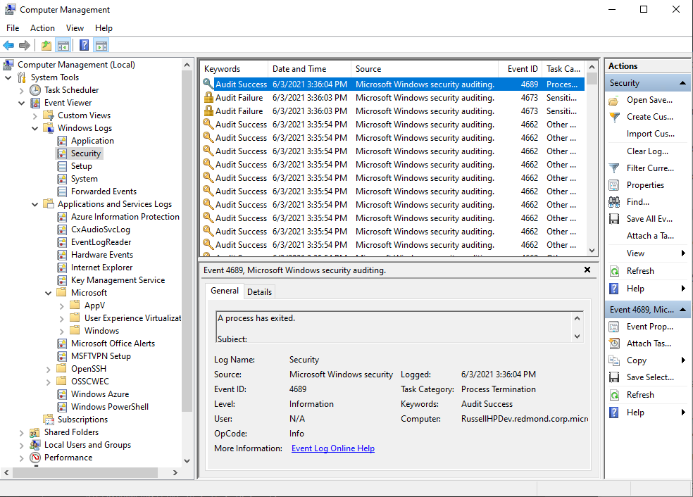

# Winlog
Winlog is a package that allows the usage of standard .Net Framework objects in the background to leverage best-in-class OS log reading capabilities, abstracting away the complexities of reading log files, while optimizing performance.

This is achieved by creating IEnumerable operators and objects which utilize log event parsing developed to maximize and simplify operations for reading Event Log files, or live OS Event Logs.

### LogReader class

LogReader is a class which hides the internal complexity of reading Windows Logs and brings the power of the .Net Framework with IEnumerables which allows the full spectrum of LINQ statements to be available.

Useful analogy is that LogReader is a high speed log viewer, which preserves functionality all delevopers enjoy and leverage:

    var log = LogReader.ReadWindowsLog("Security");

Here we created an instance, and then have the ability to enumerate through the log:

**LogReader implmentation for reading the "Security" Windows OS log:**

	foreach (LogRecord r in log.Take(10))
	{
		Console.WriteLine("{0} {1} {2}", r.TimeCreated, r.Provider, r.EventId);
	};

Typical usage would be to read from the Security, Application, or System OS log, and this library is capable of reading ANY OS log we well, such as for PowerShell, SCOM agent, etc...

What is happening internally is building enumerable readers, like this:

    /// 

    /// Reads the specified Windows Event Log and yields a stream of WinLog.LogRecord instances.
    /// 

    /// <param name="logName">string - the name of the Windows Event Log  to read.</param>
    /// <returns>IEnumerable&lt;LogRecord&gt; - an enumerable list of WinLog.LogRecord instances.</returns>
    public static IEnumerable<LogRecord> ReadWindowsLog(string logName)
    {
        var log = EvtxEnumerable.ReadWindowsLog(logName, null);
        foreach (var e in log)
        {
            var evt = LogReader.ParseEvent(e);
            yield return new LogRecord(evt);
        }
    }

Similarly, we can create an instance, and then have the ability to enumerate through a log file:

**LogReader implmentation for reading the an EVTX Windows OS log file:**

    var evtx = LogReader.ReadEvtxFile(Path.Combine(dir_info.FullName, @"LogSample.evtx")); // Read a log file from disk
    foreach (LogRecord e in evtx.Take(10))
    {
        Console.WriteLine("{0} {1} {2}", e.TimeCreated, e.Provider, e.EventId);
    }

**Single event conversion implmentation for event conversion:**

Another implementation returns a generic IDictionary<string, object> with valid names from the EventRecord .Net Diagnostics type to exactly named fields in the dictionary and equally valued types stored in the value.

    EventRecordConversion conversion = new EventRecordConversion();

    var securityEventLog = EvtxEnumerable.ReadEvtxFile(sampleEventLogFile.FullName)
        .Take(100)
        .ToList();

    foreach (EventRecord eventRecord in securityEventLog)
    {
        IDictionary<string, object> dictionaryLogRecordRaw = conversion.ToLogRecordRaw(eventRecord);

        // Get the event data
        if (Convert.ToInt32(dictionaryLogRecordRaw["EventId"]) != eventRecord.Id)
        {
            Assert.Fail();
        }
    }

Example:

XXX:

- the csl files are configuration that is passed first,
- then events are pushed in immediately as they occur (no storage is involved!)
- width of arrows represents volume in events per second. Since most events don't match any of the filters, they are **dropped**
- if an event matches some filter, we get alert on output

Filter is the simplest example of **standing-query**. Standing queries in general are data-flow graphs how to produce output event. This is concept analogous to "execution plan" in SQL except (1) the user registers a query (2) events arrive.

Let's now subscribe for the output alerts:

    using (node.Subscribe(alert => Console.WriteLine("{0} {1} {2}", 
        alert.Comment.Trim('\n','\r','\t',' '),
        alert.AlertOccurrance["Symbol"],
        alert.AlertOccurrance["Price"])))
	{ ...}

This way we send each alert to the console, as it occurs. 

This code will also work without the `using` statement. However, one of the most common bugs in using real-time queries is forgetting that `Subscribe` returns `IDisposable`. The caller must keep reference to it, otherwise the subscription is canceled. The `using` is just the common C# practice to guarantee the `IDisposable` object is alive while the code in {...} is executed.

Finally, let's produce some events:

    while (true)
    {
        var ticker = GenerateTicker();
        node.OnNext(ticker);
        Thread.Sleep(10);
    }

This invokes the method:

	static IDictionary<string, object> GenerateTicker()

Which does random stock ticker generation. Some of the tickers match the above queries, and we see alerts on the console output:

	// Some stock has high price AMZN 93
	// MSFT is high MSFT 83
	// Some stock has high price MSFT 83
	// Some stock has high price AAPL 94
	// MSFT is high
	// MSFT is low MSFT 2

Note that the random generation here is not intended to simulate actual stock market behavior. It is simply generating random symbol and random price from 0 to 99. See the entire code in [Program.cs](Rx.Kql.NodeSample/Program.cs)

### Using KQL functions in real-time queries
Sometimes, many queries have fragment that is the same. In actual Kusto (stored data) we can take such code, and encapsulate it in reusable function.

The KqlNode provides the same functionality. The '.create function' definitions  just need to be included in some of the csl files.

## Advanced usage
Rx.KQL has public classes that can be used in more advanced scenarios

### Parsing KQL into Abstract-Syntax-Tree
The parsing functionality of Rx.KQL is available separately, and can be used for many other purposes:

Here the query text can be parsed as Abstract Syntax Tree (AST) by calling constructors like:

	var q = new Query(kqlText);

The AST is internally being used in the KqlNode class described above. It is also useful for other purposes:

- modifying the AST (rewriting) such as optimizing the query
- building the AST from some other expression definition such as ArcSight XML or SQL
- translating the AST into another language such as Scala

The reverse action is going from AST to KQL string:

	string kql = q.ToString();

### Using KQL in Rx queries
Rx.KQL provides another mode of usage that is intended for developers, who are fluent with real-time events in C#, LINQ, and Rx.Net

In this mode, real-time KQL processing can be intermixed as an operator in any Rx real-time pipeline. Let's imagine the following code in the context of WinForms application (no Kusto involved!):

	var points = Observable.FromEventPattern<MouseEventArgs>(panel1, "MouseMove")
       .ToDynamic(m => m.EventArgs)
       .KqlQuery("where Button == \"Left\" | project X, Y");

Here:

- we take the real-time stream of events generated by moving the mouse
- we turn them to a dynamic object `IDictionary<string, object>`
- we apply KQL query that ignores events unless the left button is pressed, and then only take (X,Y) coordinates

The output of the Rx pipeline is drawing pixels as:

	_subscription = points.Subscribe(p =>
	    {
	        panel1.CreateGraphics().FillRectangle(pen.Brush, p.X, p.Y, 5, 5);
	    });

Here: 

- the variable `points` represents the output of the real-time query
- `_subscription` is example how one should keep the IDisposable as class member

All the event processing happens on the stream. No events are ever stored, and the final result is just pixels. If the user re-sizes the window and loses some of the pixels, they cannot be recovered. 

See also:

- Click to discover -> [Winlog Sample](../Samples/WinLog/Readme.md)
