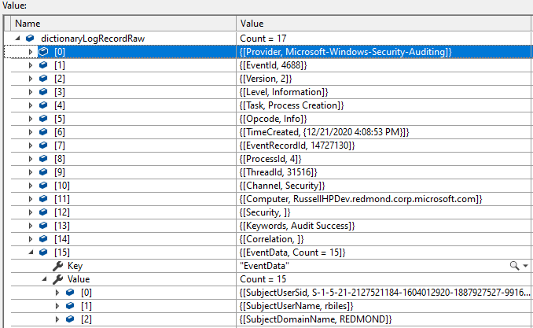

# Winlog
Winlog is a package that allows the usage of standard .Net Framework objects in the background to leverage best-in-class OS log reading capabilities, abstracting away the complexities of reading log files, while optimizing performance.

This is achieved by creating IEnumerable operators and objects which utilize log event parsing developed to maximize and simplify operations for reading Event Log files, or live OS Event Logs.

### LogReader class

LogReader is a class which hides the internal complexity of reading Windows Logs and brings the power of the .Net Framework with IEnumerables which allows the full spectrum of LINQ statements to be available.

Useful analogy is that LogReader is a high speed log viewer, which preserves functionality all delevopers enjoy and leverage:

    var log = LogReader.ReadWindowsLog("Security");

Here we created an instance, and then have the ability to enumerate through the log:

**LogReader implmentation for reading the "Security" Windows OS log:**

	foreach (LogRecord r in log.Take(10))
	{
		Console.WriteLine("{0} {1} {2}", r.TimeCreated, r.Provider, r.EventId);
	};

Typical usage would be to read from the Security, Application, or System OS log, and this library is capable of reading ANY OS log we well, such as for PowerShell, SCOM agent, etc...

What is happening internally is building enumerable readers, like this:

    /// 

    /// Reads the specified Windows Event Log and yields a stream of WinLog.LogRecord instances.
    /// 

    /// <param name="logName">string - the name of the Windows Event Log  to read.</param>
    /// <returns>IEnumerable&lt;LogRecord&gt; - an enumerable list of WinLog.LogRecord instances.</returns>
    public static IEnumerable<LogRecord> ReadWindowsLog(string logName)
    {
        var log = EvtxEnumerable.ReadWindowsLog(logName, null);
        foreach (var e in log)
        {
            var evt = LogReader.ParseEvent(e);
            yield return new LogRecord(evt);
        }
    }

Similarly, we can create an instance, and then have the ability to enumerate through a log file:

**LogReader implmentation for reading the an EVTX Windows OS log file:**

    var evtx = LogReader.ReadEvtxFile(Path.Combine(dir_info.FullName, @"LogSample.evtx")); // Read a log file from disk
    foreach (LogRecord e in evtx.Take(10))
    {
        Console.WriteLine("{0} {1} {2}", e.TimeCreated, e.Provider, e.EventId);
    }

**Single event conversion implmentation for event conversion:**

Another implementation returns a generic IDictionary<string, object> with valid names from the EventRecord .Net Diagnostics type to exactly named fields in the dictionary and equally valued types stored in the value.

    EventRecordConversion conversion = new EventRecordConversion();

    var securityEventLog = EvtxEnumerable.ReadEvtxFile(sampleEventLogFile.FullName)
        .Take(100)
        .ToList();

    foreach (EventRecord eventRecord in securityEventLog)
    {
        IDictionary<string, object> dictionaryLogRecordRaw = conversion.ToLogRecordRaw(eventRecord);

        // Get the event data
        if (Convert.ToInt32(dictionaryLogRecordRaw["EventId"]) != eventRecord.Id)
        {
            Assert.Fail();
        }
    }

Example:

More to come!!!

See also:

- Click to discover -> [Winlog Sample](../Samples/WinLog/Readme.md)
